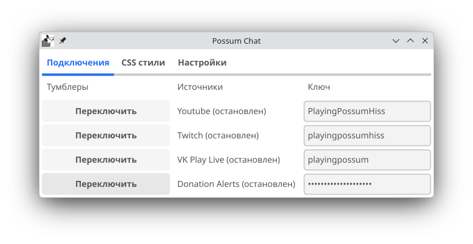
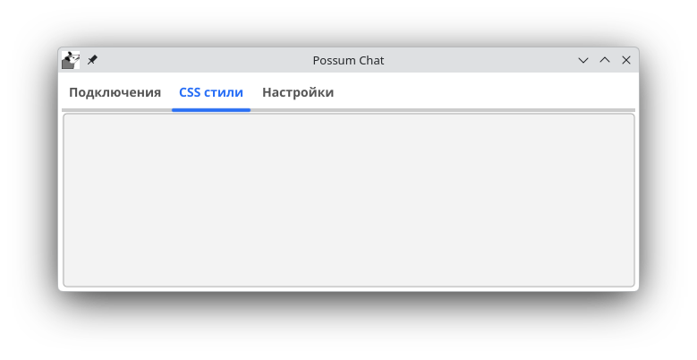
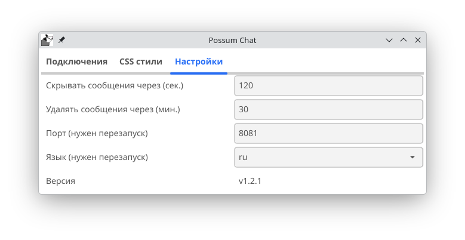

# Хотелось бы иметь мультичат под линукс

## Запуск приложения

При запуске имеем окно с тремя вкладкам



Первая - окно соединений. Мы можем указать для каждого из источников ключ, а именно:
- Для ютуба имя канала (без @) или ключ трансляции (из адресной строки)
- Для VK Play Live или Twitch - имя канала (без @)
- Для Donation Alerts - токер из адресной строки виджета для OBS

Для каждого из соединений имеется кнопка для запуска вычитки сообщений



Вторая вкладка позволяет настроить кастомные стили в виджете. Так же планируется добавить выбор одного из предустановленных стилей, но сейчас тут по умолчанию один, который я использую сам для трансляций



Настроки, а именно:
- Время через которое сообщение пропадет в виджете (т.е. у зрителей)
- Время через которое сообщение будет удалено изпамяти (т.е. в формета просмотра для стримера см. "удобно для просмотра на втором экране" в разделе Виджет)
- Порт на котором будет запушен виджет. Требует перезапуск
- Язык (английский или русский). Требует перезапуск
- Версия

## Виджет

http://127.0.0.1:8081/messages.html - виджет для OBS будет тут после запуска
http://127.0.0.1:8081/messages.html?for_last=1h - если хотим отображать все комментарии за последний час
http://127.0.0.1:8081/messages.html?for_last=1h&use_scroll=true - если в дополнение к этому хотим, чтобы список можно было скролить (удобно для просмотра на втором экране). Так же можно увидеть ошибки, если они были в логах

## Конфиг

При запуске в папке с приложением должен лежать файл config.json следующего вида. Сейчас почти все параметры вынесены в настройки, но иногда может быть нужно указать уровень логирования и путь (для расследования багов)

``` json
{
	"connections": {
		"youtube": {
			"channel_name": "PlayingPossumHiss" // так же это может быть идентификатор трансляции
		},
		"twitch": {
			"channel_name": "playingpossumhiss"
		},
		"vk_play_live": {
			"channel_name": "playingpossum"
		},
		"donation_alerts": {
			"token": "I'm a token"
		}
	},
	"loging": {
		"log_path": "./log.log",
		"level": "INFO"
	},
	"view": {
		"css_style": "",
		"time_to_hide_message": "2m0s",
		"time_to_delete_message": "1h0m0s"
	},
	"port": 8081,
	"version": "1.0"
}
```
